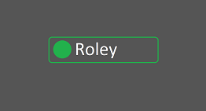

# Roley 
### A Discord bot that changes the way you see your server  
 
You see, when you have your own Discord server and it reaches more than 30 members without bots, you might want to start treating updates  
as actual updates, not just as messages that disappear somewhere in the channel even if you pin them. If you work this out, you will  
eventually start seeing complaints from your members that they do not want to receive every update. This is the tricky part.  
Here is where Roley comes in. By easily looking into the bot config by =help you can configure a message and add certain reactions to it.  
Your members can now select which notifications they want to get by simply reacting to the message with corresponding emojis. This will
significantly reduce the amount of annoying and unneccesary ping they will get and they will like to come on your server even more to hang  
out. Give it a try when it rolls out to you. *It's worth it.*  
*****
## List of commands  
=ping | Responds with *Pong!*
*****  
**The bot is available [here](https://discord.com/api/oauth2/authorize?client_id=819960497260200047&permissions=402992240&scope=bot). It has very basic functionality right now, but by adding it to your server you support Roley.**
*****  
*If you encounter any issues with Roley, open an issue.*
